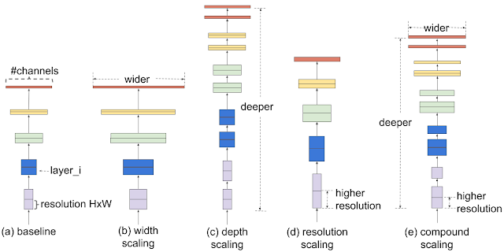

#### Generating embeddings and finding similar images

- Download pictures from the image dataset
- Run inference on them to get embeddings using EfficientNet
- Show random image, and get K-nearest neighbors to get similar flower images

#### EfficientNet: 

[GitHub Repo](https://github.com/qubvel/efficientnet)

[Google AI Blog](https://ai.googleblog.com/2019/05/efficientnet-improving-accuracy-and.html)

It is a novel model scaling method that uses a simple yet highly effective compound coefficient to scale up CNNs in a more structured manner. Unlike conventional approaches that arbitrarily scale network dimensions, such as width, depth and resolution, this method uniformly scales each dimension with a fixed set of scaling coefficients. 

#### Dataset:

[TensorFlow Flower Dataset](https://www.tensorflow.org/datasets/catalog/tf_flowers)

#### FAISS:
Faiss is a library for efficient similarity search and clustering of dense vectors. It contains algorithms that search in sets of vectors of any size, up to ones that possibly do not fit in RAM. It also contains supporting code for evaluation and parameter tuning. Faiss is written in C++ with complete wrappers for Python/numpy. It is developed primarily at [Facebook AI Research](https://ai.facebook.com/).

[GitHub Repo](https://github.com/facebookresearch/faiss)
